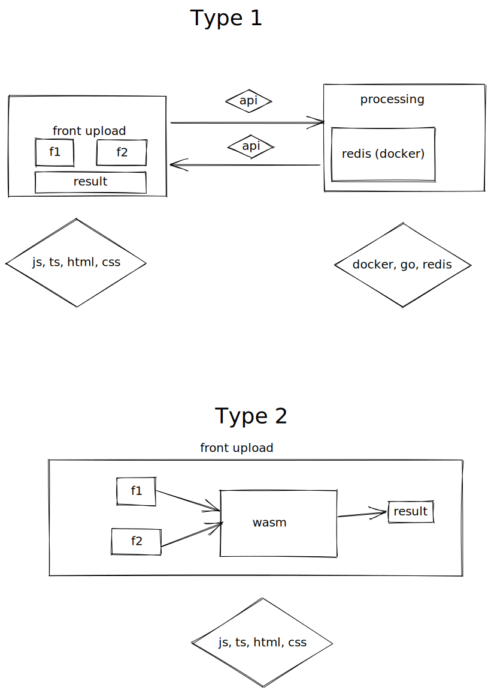

# Online PDF Editor 🥳

website that can edit PDF's

[](https://github.com/dipankardas011/PDF-Editor/actions/workflows/spellcheck.yml) [](https://github.com/dipankardas011/PDF-Editor/actions/workflows/pages/pages-build-deployment)

## Kubernetes repo for this
[`IAC repo`](https://github.com/dipankardas011/PDF-Editor-IAC)

### Tech Stack
* GO
* Docker
* HTML
<!--  redis DB -->


# Website


# Website Link
[Click Here](https://pdf-editor-tool.azurewebsites.net)

## WORK 🚧
Work | Status
-|-
Backend | ✅
Database | 🚧


### Links

[GO REDIS](https://github.com/gomodule/redigo)

[PDF search for go](https://pkg.go.dev/search?q=pdf)



Going by Type1

# How to Run

```bash
./Runner.sh
```

## connect to the redis db `UNDER DEVELOPMENT`

```bash
docker ps
docker exec it <container id> bash
redis-cli
```

## connect to the frontend

```url
localhost:80
```

```Heroku

$ docker ps
Now you can sign into Container Registry.

$ heroku container:login

$ heroku create
Creating app... done, ⬢ mysterious-hamlet-46993
https://mysterious-hamlet-46993.herokuapp.com/ | https://git.heroku.com/mysterious-hamlet-46993.git

$ heroku container:push web -a mysterious-hamlet-46993
$ heroku container:release web -a mysterious-hamlet-46993
```

Happy Coding 🥳