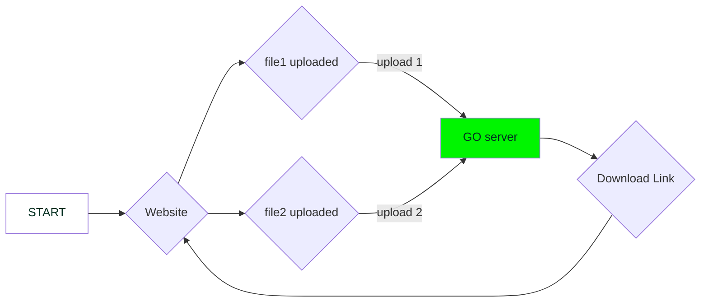

# Online PDF Editor 🥳

website that can edit PDF's

[](https://github.com/dipankardas011/PDF-Editor/actions/workflows/CI.yaml) [](https://github.com/dipankardas011/PDF-Editor/actions/workflows/pages/pages-build-deployment)

### Tech Stack
* GO
* Docker
* HTML
<!--  redis DB -->


## Current Deployment is on Heroku

# Website


# Website Link
[Click Here](https://pdf-editor-tool.herokuapp.com/)

## WORK 🚧
Work | Status
-|-
Backend | ✅
Database | 🚧


# Flow of the program using Graphs


# How to Run

```bash
./Runner.sh
```

## connect to the redis db `UNDER DEVELOPMENT`

```bash
docker ps
docker exec it <container id> bash
redis-cli
```

## connect to the frontend

```url
localhost:80
```

Happy Coding 🥳

<!-- ```bash
heroku container:login
heroku create -a <Application name>
heroku container:push web -a <Application name>
heroku container:release web -a <Application name>
``` -->
