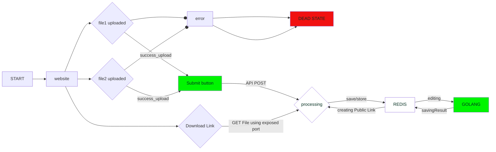

# Online PDF Editor 🥳

website that can edit PDF's

[](https://github.com/dipankardas011/PDF-Editor/actions/workflows/spellcheck.yml) [](https://github.com/dipankardas011/PDF-Editor/actions/workflows/pages/pages-build-deployment)

## Inital build
[Package Used](https://www.npmjs.com/package/pdf-merger-js)

### Tech Stack
* GO
* JS / TS
* Docker
* HTML
* redis DB

## Currently Worked on by
@umgbhalla
@dipankardas011

### Links

[GO REDIS](https://github.com/gomodule/redigo)

[PDF search for go](https://pkg.go.dev/search?q=pdf)


# Flow of the program using Graphs


Going by Type1

# How to Run

```bash
./Runner.sh
```

## connect to the redis db

```bash
docker ps
docker exec it <container id> bash
redis-cli
```

## connect to the frontend

```url
localhost:8080
```