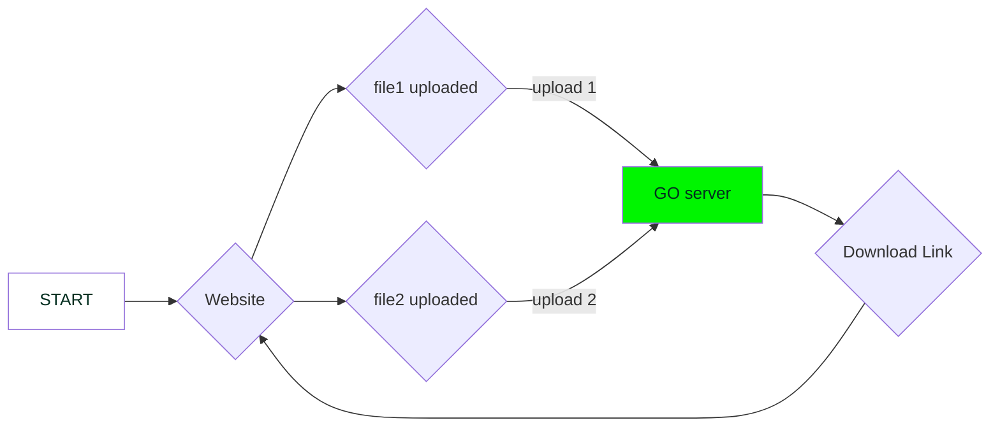

# Online PDF Editor 🥳

website that can edit PDF's

[](https://github.com/dipankardas011/PDF-Editor/actions/workflows/CI.yaml) [](https://github.com/dipankardas011/PDF-Editor/actions/workflows/pages/pages-build-deployment) [](https://artifacthub.io/packages/search?repo=pdf-editor-web) [](https://github.com/dipankardas011/PDF-Editor/actions/workflows/codeql-analysis.yml) [ Docker Signed Image Release](https://github.com/dipankardas011/PDF-Editor/actions/workflows/CD-backend-merge.yaml/badge.svg)](https://github.com/dipankardas011/PDF-Editor/actions/workflows/CD-backend-merge.yaml) [ Stable Docker Signed Image Release](https://github.com/dipankardas011/PDF-Editor/actions/workflows/CD-frontend.yaml/badge.svg)](https://github.com/dipankardas011/PDF-Editor/actions/workflows/CD-frontend.yaml) [](https://github.com/dipankardas011/PDF-Editor/actions/workflows/Datree-CD.yaml) [![ImageScan [Aqua Trivy]](https://github.com/dipankardas011/PDF-Editor/actions/workflows/imageScan.yaml/badge.svg)](https://github.com/dipankardas011/PDF-Editor/actions/workflows/imageScan.yaml) [](https://gitpod.io/#https://github.com/dipankardas011/PDF-Editor)[](https://dl.circleci.com/status-badge/redirect/gh/dipankardas011/PDF-Editor/tree/main)


## Software Requirement Specification

[Link for entire Documentation about this project](https://docs.google.com/document/d/e/2PACX-1vQvfAZFG0Tw9MAXtXXXDDGFZ6967Iz9CK1rTE9Gl-cR8fKF268qoggKPIUhKGD3fWszGFEUfwoKYC9D/pub)

[Project Board For Current Status](https://github.com/users/dipankardas011/projects/2/views/1)

Jenkins server -> [URL](http://ec2-54-211-12-103.compute-1.amazonaws.com:8080/)
> User: `guest`
> Pass: `77777`

Stage | Tags | Links
--|--|--
Production | `0.7` | https://pdf-web-editor.azurewebsites.net/
Alpha | `latest` ; `0.8` | http://44.209.39.161/

> A Humble request! 🙏 don't expoit the resources I have used here

> Release Cycle of ~1 Month

### Tech Stack
* GO
* Docker & Docker-Compose
* HTML
* K8s
* Helm
* ArgoCD
* Terraform
* Flux
* Prometheus

# Website


# How to Run

## Kustomize install
```bash
kubectl apply -k deploy/cluster/backend
kubectl apply -k deploy/cluster/frontend
```

---

## Helm plugin

### Usage


[Helm](https://helm.sh) must be installed to use the charts.  Please refer to
Helm's [documentation](https://helm.sh/docs) to get started.

Once Helm has been set up correctly, add the repo as follows:
```
helm repo add <alias> https://dipankardas011.github.io/PDF-Editor/
helm install my-pdf-editor-helm pdf-editor-web/pdf-editor-helm --version 0.1.0

```
If you had already added this repo earlier, run `helm repo update` to retrieve
the latest versions of the packages.  You can then run `helm search repo
<alias>` to see the charts.

To install the <chart-name> chart:
```
kubectl create ns pdf
helm repo add pdf-editor-web https://dipankardas011.github.io/PDF-Editor/
helm install my-pdf-editor-helm pdf-editor-web/pdf-editor-helm --version 0.1.0
```
To uninstall the chart:

    helm delete my-pdf-editor-helm

---

## From Source Code
```bash
cd deploy/cluster/
kubectl create ns pdf
helm install <Release Name> ./pdf-editor-helm
helm uninstall <Release Name> ./pdf-editor-helm
```

---

## ArgoRollouts
```sh
deploy the path deploy/blue-green to argo-cd UI
```

# How to Run

```bash
make build
make run
```

# How to Test

```bash
# Integration testing
make unit-test
# Integration testing
make integration-test
```


# To View the page visit

```url
http://localhost
```

# AWS Terraform

```bash
cd IAC/AWS
terraform init
terraform apply
# here you have to provide your access key and secret key to the input
# go to
<Elastic ip>:8080
```

# Flow of the program using Graphs


[**Changelog link**](./CHANGELOG.md)

[**Code Of Conduct**](./code-of-conduct.md)

[**Contributing Guidelines**](./CONTRIBUTING.md)

Happy Coding 👍🏼🥳


<a href = "https://github.com/dipankardas011/PDF-Editor/graphs/contributors"></a>

Made with [contributors-img](https://contrib.rocks).
