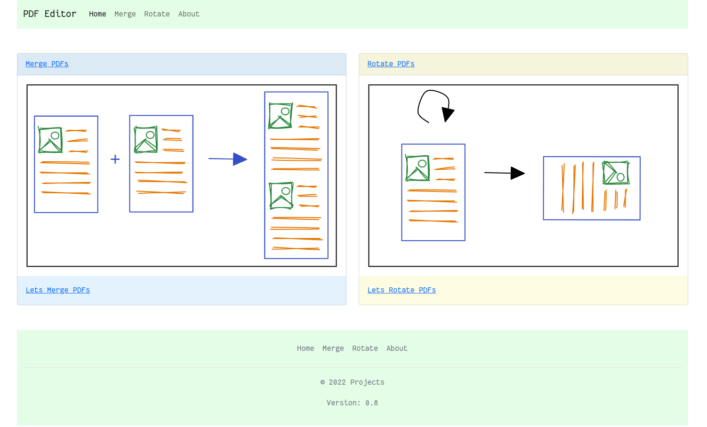
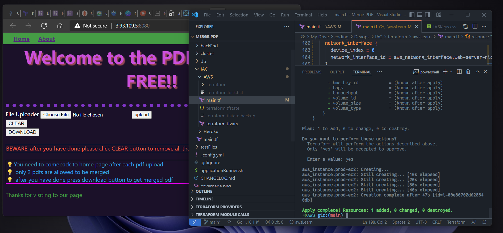
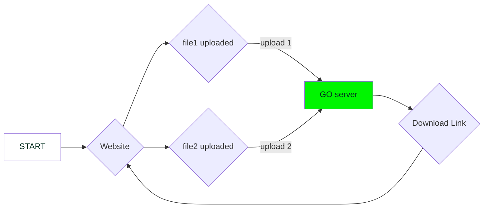

# Online PDF Editor 🥳

website that can edit PDF's

[](https://github.com/dipankardas011/PDF-Editor/actions/workflows/CI.yaml) [](https://github.com/dipankardas011/PDF-Editor/actions/workflows/pages/pages-build-deployment) 
[](https://artifacthub.io/packages/search?repo=pdf-editor-web) [](https://github.com/dipankardas011/PDF-Editor/actions/workflows/codeql-analysis.yml)[](https://github.com/dipankardas011/PDF-Editor/actions/workflows/CD.yaml) [](https://github.com/dipankardas011/PDF-Editor/actions/workflows/argoCD.yaml) [![ImageScan [Aqua Trivy]](https://github.com/dipankardas011/PDF-Editor/actions/workflows/imageScan.yaml/badge.svg)](https://github.com/dipankardas011/PDF-Editor/actions/workflows/imageScan.yaml)
[](https://gitpod.io/#https://github.com/dipankardas011/PDF-Editor

Stage | Tags | Link
--|--|--
Production | `0.5v` | https://pdf-editor-tool.herokuapp.com/
Beta | `latest` ; `0.6-rc` | https://pdf-editor-beta.herokuapp.com/

> Release Cycle of 1 Month

### Tech Stack
* GO
* Docker
* HTML
* K8s
* Helm
* ArgoCD
* Terraform

## Current Deployment is on Heroku

# Website



## WORK 🚧
Work | Status
-|-
Backend | ✅
CI/CD | ✅
AWS Terraform | ✅

# Kustomize install
```bash
cd cluster/pdf-editor-kustomize

kubectl apply -k ./prod/ # or ./dev/

```

# Helm plugin

## Usage

[Helm](https://helm.sh) must be installed to use the charts.  Please refer to
Helm's [documentation](https://helm.sh/docs) to get started.

Once Helm has been set up correctly, add the repo as follows:
```
helm repo add <alias> https://dipankardas011.github.io/PDF-Editor/
helm install my-pdf-editor-helm pdf-editor-web/pdf-editor-helm --version 0.1.0

```
If you had already added this repo earlier, run `helm repo update` to retrieve
the latest versions of the packages.  You can then run `helm search repo
<alias>` to see the charts.

To install the <chart-name> chart:
```
kubectl create ns pdf
helm repo add pdf-editor-web https://dipankardas011.github.io/PDF-Editor/
helm install my-pdf-editor-helm pdf-editor-web/pdf-editor-helm --version 0.1.0
```
To uninstall the chart:

    helm delete my-pdf-editor-helm

## From Source Code
```bash
cd cluster/
kubectl create ns pdf
helm install <Release Name> ./pdf-editor-helm
helm uninstall <Release Name> ./pdf-editor-helm
```

# AWS Terraform

```bash
cd IAC/AWS
terraform init
terraform apply
# here you have to provide your access key and secret key to the input
# go to 
<Elastic ip>:8080
```

# Flow of the program using Graphs


# How to Run

```bash
./Runner.sh
```

<!-- ## connect to the redis db `UNDER DEVELOPMENT`

```bash
docker ps
docker exec it <container id> bash
redis-cli
``` -->

## connect to the frontend

```url
localhost:80
```

Happy Coding 👍🏼🥳


<a href = "https://github.com/dipankardas011/PDF-Editor/graphs/contributors">

</a>
Made with [contributors-img](https://contrib.rocks).
