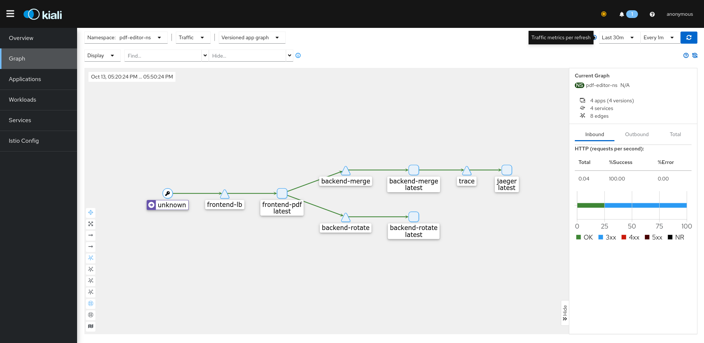
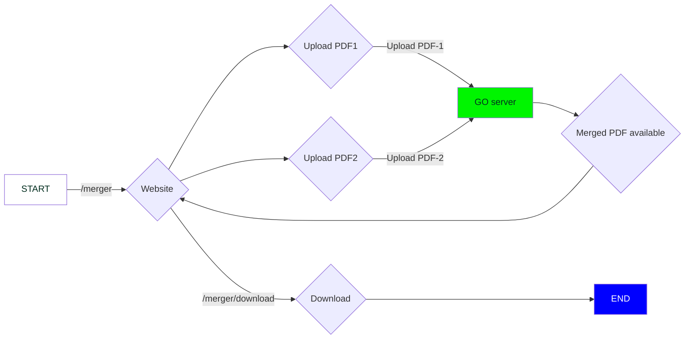
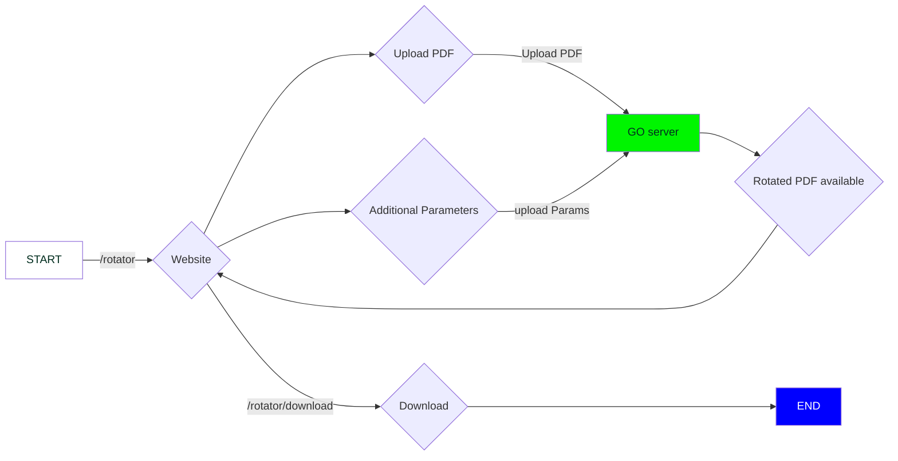

# Web-based PDF Editor 🥳

Website that can edit PDF's to give you a Merged or a Rotated version of it

[](https://github.com/dipankardas011/PDF-Editor/actions/workflows/CI.yaml) [](https://github.com/dipankardas011/PDF-Editor/actions/workflows/pages/pages-build-deployment) [](https://artifacthub.io/packages/search?repo=pdf-editor-web) [](https://github.com/dipankardas011/PDF-Editor/actions/workflows/codeql-analysis.yml) [ Docker Signed Image Release](https://github.com/dipankardas011/PDF-Editor/actions/workflows/CD-backend-merge.yaml/badge.svg)](https://github.com/dipankardas011/PDF-Editor/actions/workflows/CD-backend-merge.yaml) [ Docker Signed Image Release](https://github.com/dipankardas011/PDF-Editor/actions/workflows/CD-backend-rotate.yaml/badge.svg)](https://github.com/dipankardas011/PDF-Editor/actions/workflows/CD-backend-rotate.yaml) [ Stable Docker Signed Image Release](https://github.com/dipankardas011/PDF-Editor/actions/workflows/CD-frontend.yaml/badge.svg)](https://github.com/dipankardas011/PDF-Editor/actions/workflows/CD-frontend.yaml) [](https://github.com/dipankardas011/PDF-Editor/actions/workflows/Datree-CD.yaml) [![ImageScan [Aqua Trivy]](https://github.com/dipankardas011/PDF-Editor/actions/workflows/imageScan.yaml/badge.svg)](https://github.com/dipankardas011/PDF-Editor/actions/workflows/imageScan.yaml) [](https://gitpod.io/#https://github.com/dipankardas011/PDF-Editor)[](https://dl.circleci.com/status-badge/redirect/gh/dipankardas011/PDF-Editor/tree/main)


## Software Requirement Specification

[Link for entire Documentation about this project](https://docs.google.com/document/d/e/2PACX-1vQvfAZFG0Tw9MAXtXXXDDGFZ6967Iz9CK1rTE9Gl-cR8fKF268qoggKPIUhKGD3fWszGFEUfwoKYC9D/pub)

[Project Board For Current Status](https://github.com/users/dipankardas011/projects/2/views/1)

~Jenkins server -> [URL](http://ec2-XX-XX-XX-XX.compute-1.amazonaws.com:8080/)~
> **Note**

> User: `guest`
> Pass: `77777`

> (Available till 15th Sep '22) Due to 💰 had to stop the instance

Stage | Tags | Links | Status
--|--|--|--
Production | `1.0` | https://pdf-web-editor.azurewebsites.net/, http://70f4921e-d7ff-4641-aa81-efe510f687ac.lb.civo.com | ✅
Alpha | `latest` ; `1.0` | http://44.209.39.161/ | ✅

> A Humble request! 🙏 don't expoit the resources I have used here

> Release Cycle of ~1 Month

### Tech Stack
* GO
* Docker & Docker-Compose
* HTML
* K8s
* Helm
* ArgoCD
* Terraform
* Flux
* Prometheus

# Website


# How to Run

## Kustomize install
```bash
kubectl apply -k deploy/cluster/backend
kubectl apply -k deploy/cluster/frontend
```

---


## Helm plugin

### Usage


```bash
kubectl create ns pdf
helm repo add pdf-editor-web https://dipankardas011.github.io/PDF-Editor/
helm install my-pdf-editor-helm pdf-editor-web/pdf-editor-helm --version 0.1.0
```
To uninstall the chart:

    helm delete my-pdf-editor-helm

---

## From Source Code
```bash
cd deploy/cluster/
kubectl create ns pdf
helm install <Release Name> ./pdf-editor-helm
helm uninstall <Release Name> ./pdf-editor-helm
```

---

## ArgoRollouts
```
# using Argo-CD to deploy
deploy the path deploy/rollouts
With namespace set to pdf-editor-ns
```

# How to Run

```bash
make run
```

# How to Dev

```bash
cd src/
skaffold dev
```

# How to Test

```bash
# Integration testing
make unit-test
# Integration testing
make integration-test
```


# To View the page visit

```url
http://localhost
```

# More Info
<details>
<summary><kbd>Production Cluster</kbd></summary>
<h3>Civo Dashboard</h3>


<h3>Youtube Video</h3>
    
[](http://www.youtube.com/watch?v=bstJHtv0L_s "Video Title")
    
</details>

# Blog Post on this project
[](https://blog.kubesimplify.com/about-my-pdf-editor-project)


# Decission Tree

# Trace


## Frontend -> Backend-Merger


## Frontend -> Backend-Rotator


[**Changelog link**](./CHANGELOG.md)

[**Code Of Conduct**](./code-of-conduct.md)

[**Contributing Guidelines**](./CONTRIBUTING.md)

Happy Coding 👍🏼🥳


<a href = "https://github.com/dipankardas011/PDF-Editor/graphs/contributors"></a>

Made with [contributors-img](https://contrib.rocks).
